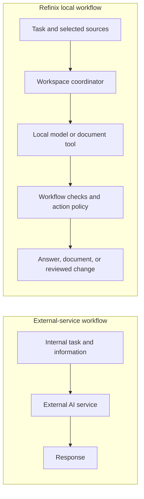
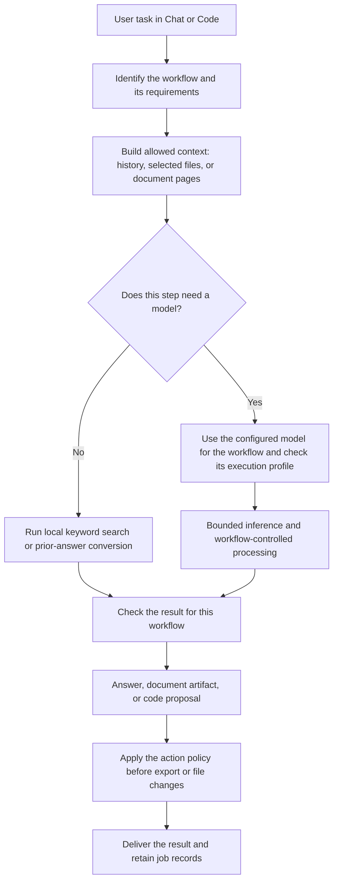
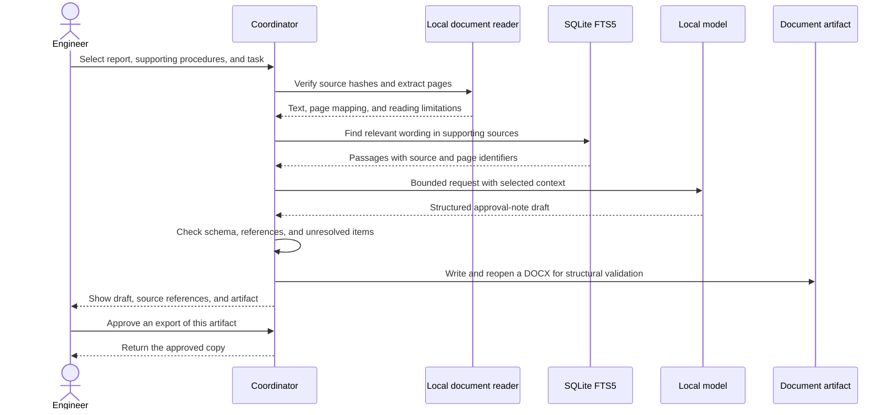
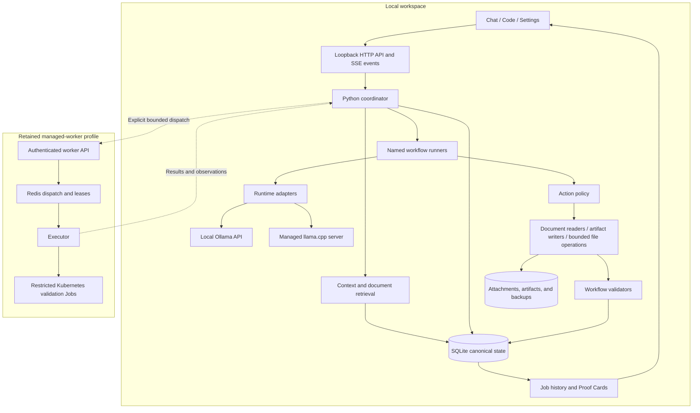
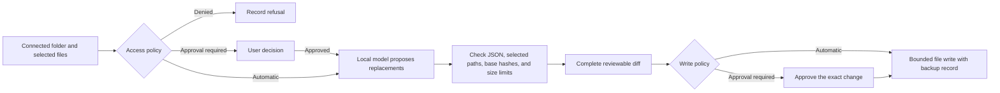
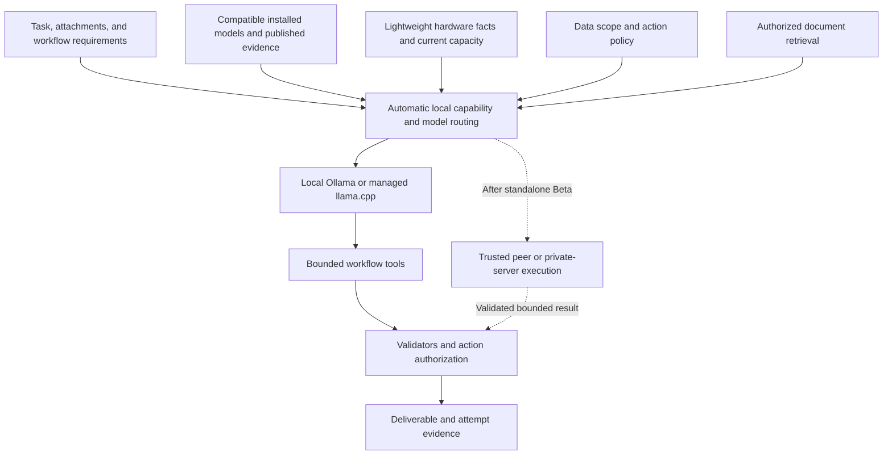

<div align="center">


# Refinix

**Private AI for the documents, decisions, and technical work inside an organization.**

Work with selected internal information using local models, controlled workflows, and reviewable outputs. Refinix keeps workspace state and action authority with the coordinator that owns the task.

[How it works](#how-refinix-works) · [Architecture](#architecture) · [Security boundary](#security-and-trust-boundary) · [Quick start](#quick-start)

</div>

## Why Refinix

An inspection report can contain equipment conditions. A procedure can describe restricted operating practices. An internal repository can expose designs or business logic. Sending this material to an external AI service changes who receives it and which infrastructure processes it—decisions an organization needs to control.

Refinix provides a workspace for using local AI on that work. Chat handles questions and document tasks; Code handles selected repository files and reviewable changes. The coordinator manages context, workflow steps, permissions, saved state, and deliverables around the model.

The useful output may be an answer with source references, an approval-note draft, a Word document, or a proposed code change. The model generates content; Refinix determines which inputs it receives and which actions the workflow can perform.

### The core idea



This describes the intended data-handling choice. Whether an installation enforces an offline boundary still depends on its runtime, network controls, and observed behavior. Refinix's evidence surfaces make those distinctions explicit.

## How Refinix works

The current harness follows named workflows. A request's surface, selected skill, attachments, and workflow settings determine its execution path. It does not require a separate model to classify every request.



1. **Establish the task boundary.** The coordinator records the request and a job. A document request binds its selected sources; Code binds a connected repository and selected files. Instructions inside those files remain untrusted task data.
2. **Prepare useful context.** Saved conversation history is selected within a context budget. Document extraction preserves source identity and page associations; keyword retrieval finds passages from the selected documents. A bounded prompt can omit context without deleting saved history.
3. **Execute the eligible path.** Model steps use the configured workflow model, runtime settings, and capability/profile checks. Some operations, including keyword search and copying a completed answer into a document, need no new model generation. Automatic task-to-model routing is a target capability.
4. **Check and deliver.** Validators check the relevant structure, paths, hashes, references, or artifact format. File changes and artifact export follow their action policy. Attempts and events retain the result, failures, and available evidence.

## From an inspection report to an approval-note draft

Consider an engineer preparing a maintenance review. The inputs are a selected inspection report and supporting procedures. The request is: “Prepare an approval-note draft from these sources; keep missing facts and unresolved references visible.”

The repository implements this named document workflow as `inspection_report_to_approval_note`. It is available only with an eligible structured Documents profile and the required local reading tools.



The draft does not approve maintenance or establish that equipment is safe. The engineer reviews its conclusions. A reference resolving to a real page is useful traceability, but it does not prove that the page supports every interpretation.

### Organizational knowledge and memory

Today, document knowledge is **scoped to the sources selected for a request**. Text, Word, spreadsheet, PDF, and supported image readers feed extracted material into the workflow. PDF text is read locally; scans and images need an eligible local vision/OCR path. Unavailable reading capabilities are reported rather than replaced with invented content.

Retrieval uses [SQLite FTS5](https://www.sqlite.org/fts5.html) keyword matching. Source identifiers, hashes, and page records connect retrieved passages to their origin. Earlier attachments require explicit same-chat reuse and revalidation. General document drafts and prior-answer conversions do not acquire the citation guarantees of the structured approval-note workflow.

Saved conversations and drafts provide continuity. They are separate from document indexes, and neither constitutes model training. A governed organization corpus with access-aware hybrid retrieval is part of the target architecture.

## Architecture

The application UI is plain HTML, CSS, and JavaScript, served by the Python coordinator. A [pywebview](https://pywebview.flowrl.com/) shell supplies the native window and a small bridge for actions such as file and repository selection. The coordinator uses Python's HTTP server, SQLite, and shared Pydantic contracts; the retained worker API uses FastAPI.



The coordinator holds the canonical request, conversation, approvals, and final-write authority. Redis carries disposable coordination state in the managed-worker profile; it is not the workspace database. Worker results return to the coordinator for acceptance.

The two runtime adapters serve different current installation paths. Source checkouts can use an existing local Ollama service. Managed-engine builds use pinned llama.cpp files, checked before launch, with a loopback listener and a per-launch API key. The broader product direction makes model origin choose between these paths without duplicating Ollama weights.

The current curated model artifacts are `qwen3.5:4b-q4_K_M` for Ollama and a pinned Unsloth Qwen3.5 4B Q4_K_M GGUF with a vision projector for the managed engine. Their source revisions, licences, hashes, and workflow evidence are recorded separately in the [model catalogue](docs/model-catalog.md). The catalogue does not imply that every capability is ready on every computer.

Desktop work does not require Docker, Kubernetes, or Redis. The worker infrastructure is retained for bounded managed execution and later trusted-device support.

## Controlled agent execution

Refinix's current agent behavior is implemented through workflow-specific steps and output contracts. The harness owns tool use. For Code, the model receives labelled selected-file content and returns proposed replacements; it receives no command runner or authority to alter the access mode.



The default **Partial access** mode permits selected reads and proposals, then requires approval for writes. **Ask before actions** also requires approval for reads. **Full access** permits eligible existing-file replacements inside the connected folder without asking each time; it does not enable project commands, Git, installs, network access, or file creation/deletion/renaming.

Local Apply/Undo is explicitly labelled **not sandbox tested**. The retained worker route has a bounded Python validation path with separate results. Neither a well-formed proposal nor a successful write proves the generated code is correct.

## Security and trust boundary

The boundary is defined by what each component can read, send, and write.

| Boundary | Mechanism and scope |
|---|---|
| UI to coordinator | A loopback listener, local Host/Origin checks, bounded requests, and a native bridge that does not accept arbitrary commands or filesystem paths from the page. |
| Documents to model | Request-bound sources, hash revalidation, page mapping, bounded context, and untrusted-data framing. Prompt framing helps describe the boundary; policy and validators enforce actions. |
| Model to files | Strict output parsing and selected-path/base-hash checks. The coordinator applies the access policy; model output cannot approve itself. |
| Artifact to user | Generated files remain in local artifact storage until a recorded, single-use export approval bound to the digest allows a copy out. |
| Coordinator to worker | The retained path uses pairing credentials, pinned TLS identity, bounded task packages, and receiver checks. Pairing does not merge workspaces or grant final-write authority. |
| Code to execution environment | Retained Kubernetes validation jobs have restricted resources and network policy. Standalone desktop sandbox support still needs qualification per offered profile. |
| Setup to upstream sources | Model downloads and update checks are user initiated. Managed files have recorded provenance and integrity checks. Connected setup is distinct from ordinary task execution. |

Canonical state lives in SQLite and adjacent local storage outside replaceable application files. The path resolver supports platform data roots, an explicit portable root, and legacy `.aegisforge` state without silently relocating it. Selected Code files remain in the connected repository; writes there use the Code policy and recovery records.

Local inference is the product requirement. A loopback endpoint alone cannot prove model locality or block traffic from another process. The current observer watches coordinator connections and samples the owned engine's sockets; it does not block traffic, cover the whole host, or observe externally owned Ollama as an owned engine. Network isolation claims need named enforcement and observation evidence.

See the [security contract](docs/security.md) for the detailed boundaries.

## Evidence and traceability

Refinix records jobs, attempts, lifecycle events, model/profile information, document sources, approvals, validation results, and artifact hashes where those records exist. A Proof Card assembles evidence for an attempt from those records and identifies the source of each displayed value.

A reviewer can inspect the recorded request and route, the document references or selected-file authorization, the resulting artifact or proposal, and the associated approvals. This is a local application record, not a certified immutable audit service.

Evidence has a scope. A missing observation stays **unavailable**. A validation attempt that ran no model has no model evidence. A configured network policy is not a measured traffic count. An observed count covers its stated window and processes, not permanent host-wide isolation.

## Current Implementation

The repository contains a working macOS-first prototype and portable foundation work. Its current paths include local Chat, request-bound document reading/search, document generation, Code proposals and Apply/Undo, durable state and recovery, model management, and Proof Cards.

| State | What the checkout contains |
|---|---|
| Implemented paths | Native shell and served UI; local runtime adapters; persisted conversations/jobs; FTS5 retrieval; DOCX artifacts; Code policy, proposals, backups, and approvals. Availability still depends on the installed runtime and capability/profile checks. |
| Conditional or partial | Structured document workflows need an eligible profile. Scan/image reading needs a local vision model. PDF generation uses macOS frameworks. Package and update tooling exists, with acceptance still pending. |
| Retained prototype infrastructure | Worker API/executor, pairing/revocation, Redis coordination, and Kubernetes validation. Broader desktop-peer placement is deferred from the first Beta. |
| Target capabilities | Automatic local model assignment, broader compatible model discovery/admission, complete standalone packages across Windows/macOS/Linux, qualified local sandbox profiles, and governed organizational retrieval. |

Installed weights can currently be refused when no checked execution profile exists for that runtime/hardware/workflow combination. The current product contract calls for replacing blanket measurement gates with actual compatibility, locality, capacity, and policy checks. That change is pending.

Synthetic fixtures and frontend test surfaces are available for verification. They are distinct from ordinary application inference and do not establish customer deployments or model accuracy.

## Target Architecture

The first Beta is intended to provide a complete standalone journey on qualified Windows, macOS, and Linux profiles. It reuses the existing coordinator and workflow harness.



**Local model routing.** Choose an eligible installed model from task needs, supported capabilities, current resources, and published evidence. Record the choice and reason. Users retain preferences and may choose beyond recommendations; there is no claim of an optimal choice for every task.

**Standalone operation.** Complete graphical setup, compatible model provisioning/reuse, supported document and Code workflows, local isolation on eligible profiles, and authenticated user-initiated updates. Package/device/recovery evidence must support each advertised platform profile.

**Organizational knowledge.** Extend selected-document keyword retrieval into authorized corpus ingestion and qualified lexical/semantic retrieval, preserving source identity, version, and access scope. Indexing remains separate from training.

**Trusted compute after Beta.** Send complete jobs or bounded steps to authenticated peers or private servers, with receiver capacity admission and minimal inputs. The requesting coordinator retains canonical state and final writes. This direction does not shard a model across laptops or pool their VRAM.

The [project contract](docs/PROJECT.md), [model catalogue](docs/model-catalog.md), and [release contract](docs/releases.md) define this direction.

## Industrial use cases

| Work | Refinix's role | Human responsibility |
|---|---|---|
| Inspection review | Prepare a structured approval-note draft from a selected report and supporting procedures, on an eligible Documents profile. | Confirm source applicability, technical findings, and the final decision. |
| Procedure and internal-document lookup | Find wording across selected documents and return source/page references; use local generation where supported. | Check that the selected documents are current and sufficient. |
| Internal technical maintenance | Propose changes to selected existing code files, expose the diff, and apply according to the repository access mode. | Review correctness and arrange appropriate execution tests. |

These describe product workflows and intended organizational use, not reported customer installations.

## Quick start

Run commands from the repository root. This is a **developer source setup**. Use Python 3.12 for the current desktop packaging profiles; CI separately exercises Python 3.13. A native window also requires the platform's WebView dependencies. Inference needs compatible local weights and an eligible runtime/profile.

Create an environment:

```sh
python -m venv .venv
```

Activate it with `. .venv/bin/activate` on macOS/Linux or `.venv\Scripts\Activate.ps1` in Windows PowerShell. Install the shared source dependencies, then open the app:

```sh
python -m pip install -r desktop/requirements-desktop.txt
python -m pip install --require-hashes -r backend/requirements-runtime.lock
python -m desktop
```

These dependency installs use network access unless suitable packages are already available locally. The desktop [platform lockfiles and setup notes](desktop/README.md) describe the more constrained build environments, including native dependencies.

For services without a native window:

```sh
python -X utf8 -m desktop --no-window
```

Or run the coordinator alone:

```sh
python -m backend.coordinator
```

The coordinator defaults to `http://127.0.0.1:8770`. The desktop startup checks the local runtime and reports model readiness; the coordinator-only command does not provide that desktop startup sequence.

The current Ollama baseline is `qwen3.5:4b-q4_K_M`. Reuse installed weights when available. Obtaining missing weights is a separate, explicit connected action; the catalogue records this baseline command:

```sh
ollama pull qwen3.5:4b-q4_K_M
```

A source checkout without a managed engine uses the local Ollama path. Managed model/engine setup follows its recorded manifests and provisioning path. Hardware suitability depends on weights, context, runtime buffers, and available memory; no universal hardware minimum is release-accepted.

### Configuration

| Setting | Purpose |
|---|---|
| `--state` | Select an explicit SQLite workspace database outside the repository. |
| `--port` | Set the preferred loopback port. Desktop startup selects another free port when necessary. |
| Settings → Models | Select workflow models, inspect readiness/provenance, and run available explicit self-tests. |
| `REFINIX_ENGINE=ollama` | Choose the external Ollama development path in a source checkout. |
| `REFINIX_DATA_ROOT` | Select an explicit absolute data root; legacy-store conflicts are handled separately by the path resolver. |

## Verification

The [CI workflow](.github/workflows/ci.yml) contains offline source checks and their dependency lockfiles. Representative commands are:

```sh
python -m unittest discover -s backend/contracts -t . -p 'test_*.py' -q
python -m unittest discover -s backend/coordinator -p 'test_*.py' -q
node --test frontend/app/test-*.cjs
```

The retained worker suite is intended for a suitable Unix/Linux environment:

```sh
python -m unittest discover -s backend/worker -p 'test_*.py' -q
```

The frontend glob is the form used in Linux CI. On shells that do not expand it, pass the individual test filenames.

<details>
<summary>Observed Windows checks from the October 2026 README review</summary>

- Frontend: **203/203 passed**.
- Shared contracts: **20/20 passed** with normal temporary-file access.
- Local desktop services reached `127.0.0.1:8770` using UTF-8 console output. The temporary service was stopped afterward and the listener was confirmed closed.
- Ollama 0.30.10 and the installed Qwen model were detected. This host lacked a checked execution profile, so inference was unavailable; no model-response verification passed.
- The coordinator suite terminated without a completed result on Windows with an access-violation exit. The worker suite could not run fully because its validator imports Unix-only `resource`.
- Earlier sandboxed attempts were also blocked by temporary-file and loopback permissions. Those runs are not passes.

These are bounded observations from one environment. They do not establish package acceptance, model quality, standalone sandbox qualification, or host-wide network isolation. See the [evaluation record](docs/evaluation.md) for separately recorded evidence.

</details>

## Repository structure

| Path | Responsibility |
|---|---|
| [`frontend/app/`](frontend/app) | Served Chat, Code, Settings UI and frontend checks. |
| [`desktop/`](desktop) | Native shell, lifecycle, engine/build inputs, platform packaging. |
| [`backend/coordinator/`](backend/coordinator) | API, context, document/Code workflows, runtime adapters, policy, state, artifacts, and evidence. |
| [`backend/contracts/`](backend/contracts) | Typed job/attempt/event/approval records and execution profiles. |
| [`backend/worker/`](backend/worker) | Retained worker API, dispatch, executor, and validation. |
| [`deploy/k3s/`](deploy/k3s) | Optional managed worker, Redis, and restricted validation manifests. |
| [`fixtures/c07/`](fixtures/c07) | Synthetic document and Code examples with expected results. |
| [`docs/PROJECT.md`](docs/PROJECT.md) | Current product contract, with focused security, model, and release documents beside it. |

The [design reference](frontend/design) is separate from the application UI served by the coordinator. Contributions follow [CONTRIBUTING.md](CONTRIBUTING.md).

## License

Refinix source is licensed under [Apache License 2.0](LICENSE). Model weights, runtimes, dependencies, and organizational corpora retain their own licences and provenance requirements. The repository licence does not grant rights to third-party data.
