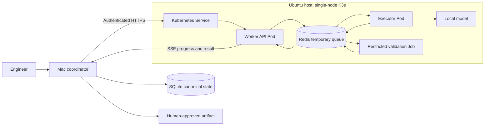
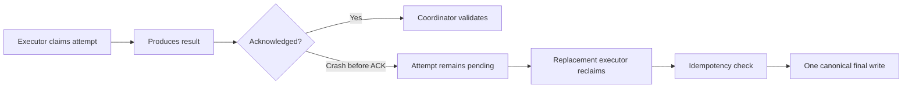

# SIH26117 PPT Submission Research Brief

## Document role

| Field | Value |
|---|---|
| Purpose | Source brief for the six-slide SIH idea-submission PPT/PDF and the six-minute internal pitch |
| Audience | Rokunin Sync presentation, design, research, demo, and Q&A owners |
| Problem statement | SIH26117 — Sovereign On-Premise Agentic AI Workbench using Open-Weight Multimodal LLMs for Confidential Industrial Work |
| Problem owner | Mangalore Refinery and Petrochemicals Limited (MRPL) |
| Category / theme | Software / Smart Automation |
| Repository | AegisForge |
| Product working name | Refinix |
| Status | Presentation research brief; not the v1 baseline and not runtime evidence |
| Last researched | 2026-09-02 |

> **This document is deliberately non-normative.** It helps presentation workers
> explain the proposed product. It does not replace the [PRD](prd.md), change
> implementation scope, or prove that a planned capability works. Before the
> final PDF is uploaded, the team leader must recheck the live SIH portal,
> official template, registered team name, Team ID, deadline, submission terms,
> and every prototype claim.

## 1. Communication job

By the end of the six-slide deck, SIH evaluators should understand that Refinix
is not another local chatbot: it is a practical, auditable, air-gapped workbench
that uses approved local models to produce real industrial artifacts, keeps
consequential actions under human control, and can use trusted local compute
without moving canonical organisational data away from the coordinator.

The one sentence the audience should remember is:

> **Refinix turns confidential scans and engineering requests into validated,
> human-approved deliverables using local AI, with per-job evidence that the
> demonstrated workflow did not use public-cloud inference.**

## 2. Submission facts and verification boundary

### 2.1 Stable facts in the current problem-statement record

- PS number: **SIH26117**
- Serial number: **117**
- Organisation and department: **Mangalore Refinery and Petrochemicals Limited
  (MRPL)**
- Category: **Software**
- Theme: **Smart Automation**
- Dataset guidance: use open-source models and public document samples; no
  proprietary MRPL data is required for the demonstration.
- Registered team name in the repository: **Rokunin Sync**

### 2.2 Recheck immediately before submission

- Team ID assigned by the portal
- Exact registered team name and spelling
- Current idea-submission deadline
- Current idea-count cap and availability of SIH26117
- Official file type, file-size limit, slide limit, and naming rule
- Whether the institute adds fields beyond the national template
- Submission/IP/licensing declarations
- Mentor and institute names, if required

The official problem page is at
[sih.gov.in/sih2026PS](https://www.sih.gov.in/sih2026PS). Automated retrieval
was blocked during this research pass. A community-maintained archive scraped
the record on 2026-08-29 and should be treated only as a backup snapshot:
[SIH26117 archive](https://github.com/vedantchalke36/sih-2026-problem-statements/blob/main/ps_2026/SIH26117.md).

The official presentation file is linked as
[SIH2026 Idea Presentation Format](https://sih.gov.in/letters/2026/SIH2026-IDEA-Presentation-Format.pptx).
Multiple 2026 institute notices describe it as a strict six-slide structure:
title, proposed solution, technical approach, feasibility, impact, and
references. The downloaded official file remains the final authority.

## 3. Exact problem context

### 3.1 The industrial situation

Refineries, PSUs, defence-linked manufacturers, and government offices perform
large amounts of sensitive knowledge work:

- approval notes and internal correspondence;
- board presentations and spreadsheet work;
- engineering calculations;
- code for internal tools;
- inspection reports, drawings, photographs, and P&IDs;
- manuals, SOPs, vendor information, financial data, and unreleased designs.

Public AI assistants can be productive, but uploading confidential inputs to a
third-party service may conflict with organisational policy and creates a data
handling risk. The alternative is often manual work or ungoverned use of public
tools. The challenge therefore asks for useful AI capability inside the
organisation's own controlled environment.

### 3.2 What the problem statement actually demands

The requested workbench must address all of these ideas:

1. **Self-hosted and air-gapped operation** — normal work must not require a
   public-cloud model.
2. **Multiple open-weight models** — the backend must not be permanently tied
   to one model.
3. **Task-aware model selection** — different task types may require different
   models or strategies.
4. **Agentic execution** — the system plans bounded steps, invokes local tools,
   validates output, and iterates where allowed.
5. **Multimodal input** — scans, images, handwritten notes, drawings, and
   photographs are named input classes.
6. **Real deliverables** — Word, Excel, PowerPoint, code, calculations, and
   approval notes are more valuable than a chat transcript.
7. **Local organisational grounding** — manuals, SOPs, and correspondence must
   remain local and produce traceable evidence.
8. **Visible sovereignty evidence** — logs or network monitoring must support
   the claim that no external calls occurred during the demonstrated window.

### 3.3 Expected-solution minimum

The current problem record asks evaluators to see:

- a working local deployment on one workstation or server with a mid-range GPU;
- automatic model selection across at least two task types;
- an end-to-end agentic workflow such as scanned report to Word approval note;
- a coding task executed and verified in a sandbox;
- a multimodal image or scanned-document task;
- visible logs or network-monitor evidence of no external calls.

### 3.4 Problem definition for the pitch

Do not pitch the problem as “companies need ChatGPT locally.” That is too broad
and already addressed by mature self-hosted interfaces.

Pitch it as:

> **Confidential industrial knowledge work needs more than local text
> generation. Organisations need model selection, document grounding, bounded
> tool execution, real artifacts, human approval, and evidence of where every
> job ran.**

## 4. Proposed solution

### 4.1 Recommended idea title

> **Refinix — Auditable, Air-Gapped Agentic AI for Industrial Knowledge Work**

Use only one product name throughout the final deck. The repository is
`AegisForge`, the current product working name is `Refinix`, and `Rokunin Sync`
is the team. Adding another public-facing name will weaken recall.

### 4.2 One-line solution

> Refinix is an installable local agent workbench that routes confidential
> document and coding tasks to approved local models, produces validated
> artifacts, requires human approval for consequential writes, and records a
> per-job sovereignty proof.

### 4.3 Portal-ready abstract

Refinix is an installable, self-hosted agentic AI workbench for confidential
industrial workflows. Unlike public-cloud assistants, its offline runtime keeps
documents, prompts, models, and artifacts on organisation-controlled devices. A
local coordinator stores canonical state in SQLite, selects an approved model
through deterministic capability routing, and executes bounded workflows for
scanned documents and code. Docker packages workers; a single-node K3s cluster
manages Pods; a Kubernetes Service provides a stable authenticated LAN endpoint;
and Redis Streams coordinates temporary jobs and heartbeats without storing
permanent business state. The Documents workflow extracts a scanned inspection
report, retrieves relevant SOP sections locally, preserves page citations and
uncertainty, and generates a Word approval note. The Code workflow creates a
patch in a network-disabled short-lived Job, records validation output, and
waits for human approval before any final write. A Sovereign Proof Card records
the selected model and device, file hashes, validation, approvals, and scoped
network observations. Refinix works on one device and can use trusted local
machines for independent tasks; it does not claim to combine GPU memory or
split one model across student laptops.

### 4.4 Product surfaces

| Surface | User outcome |
|---|---|
| Chat | Ask questions and reason over approved local knowledge |
| Documents | Extract scans, retrieve SOP evidence, cite sources, and generate artifacts |
| Code | Inspect bounded repository context, create a patch, validate it in isolation, and request approval |
| Control Center | See models, devices, routing, Pods, queues, jobs, approvals, failures, and sovereignty evidence |

### 4.5 Hero workflow

Use one story as the center of the presentation:

1. An engineer selects a public sample inspection report and local sample SOP.
2. Refinix hashes the input and creates a job in coordinator SQLite.
3. The deterministic router selects an eligible document model and device.
4. Local OCR/vision extracts page-linked findings and preserves uncertainty.
5. Local retrieval selects relevant SOP sections with page/section citations.
6. The drafting step produces a Word approval note.
7. Artifact validation checks readability, citations, origin, and checksum.
8. The engineer reviews and approves the final export.
9. A Sovereign Proof Card records where the job ran and what was observed.

The secondary workflow is code:

1. The user selects a synthetic repository and requests a bounded change.
2. Only relevant files enter a temporary workspace.
3. A coding model produces a patch.
4. A short-lived Kubernetes Job runs the approved validation command with
   networking disabled and resource limits.
5. The coordinator verifies paths and patch applicability.
6. A human approves or denies the canonical write.

## 5. Architecture story

### 5.1 Slide-safe architecture



The diagram must be simplified when placed on a slide. Keep only these labels:
**Coordinator**, **SQLite**, **Service**, **Redis**, **Worker Pod**, **Local
Model**, **Sandbox Job**, and **Proof Card**.

### 5.2 Correct role of each mentor-requested technology

| Mentor direction | What it means in Refinix | What it does not mean |
|---|---|---|
| Docker | Builds reproducible OCI images containing the worker application and dependencies | Model weights are not baked into the image |
| Kubernetes / K3s | Runs and replaces Pods, supplies Services, Jobs, limits, and observable workload state | It is not a six-laptop cluster or a replacement for the product coordinator |
| Pods | Execute the worker API, job consumers, and short-lived validation work | Two containers do not automatically “form a Pod”; a Pod may contain one or more containers |
| Service API | A versioned FastAPI node contract is deployed behind a Kubernetes Service with a stable endpoint | The Kubernetes API is not exposed as the product API |
| Redis | Carries temporary dispatch, leases, heartbeats, cancellation, progress, and bounded cache state | It is not chat history, model KV memory, approval authority, or permanent storage |

### 5.3 Why SQLite and Redis both exist

| SQLite on coordinator | Redis inside K3s |
|---|---|
| Canonical chats and jobs | Temporary work queue |
| Approvals and final-write state | Consumer-group and pending state |
| Artifacts and audit metadata | Leases and heartbeats |
| Survives Redis/cluster restart | Disposable and bounded by TTL/memory |
| Source of truth | Coordination mechanism |

### 5.4 Failure story



This is at-least-once execution with exactly-once **canonical final-write
behaviour**, not magical exactly-once computation.

### 5.5 Task-level distribution, not model sharding

Refinix may send different complete tasks to different eligible machines:

```text
Document extraction -> document-capable worker
Code patch          -> coding-capable worker
General chat        -> local coordinator device
```

It does not pool VRAM, combine GPUs, or split one model across all laptops.

## 6. Innovation and differentiation

### 6.1 Defensible differentiators

1. **Sovereign Proof Card** — evidence is bound to one job, device, model,
   artifact, approval, network method, and observation window.
2. **Coordinator-owned authority** — temporary workers can disappear without
   becoming the owner of chats, files, approvals, or final writes.
3. **Artifact-first workflows** — the memorable result is a cited Word note and
   a validated patch, not another chat response.
4. **Deterministic capability routing** — routing uses task type, approved model
   manifests, health, compatibility, and queue state; a model does not bypass
   safety filters.
5. **Human approval at the final boundary** — workers can draft and validate,
   but cannot approve their own persistent changes.
6. **Standalone plus optional trusted compute** — the application remains
   useful if the K3s host or another worker is unavailable.

### 6.2 Honest prior-art position

Local inference and offline chat are not unique. Ollama and llama.cpp provide
local model runtimes. Open WebUI already offers self-hosted offline operation,
RAG, tools, and model/provider integration. Do not claim “first local AI” or
“the only offline AI workbench.”

The pitch is the proposed combination and proof discipline:

| Existing category | Already does well | Refinix presentation focus |
|---|---|---|
| Public AI assistants | Strong models and polished workflows | Avoid public inference for confidential runtime work |
| Local model runners | Efficient local inference APIs | Add bounded workflows, approvals, artifacts, and evidence |
| Self-hosted AI interfaces | Local chat, RAG, tools, model integration | Add coordinator-owned distributed jobs, failure semantics, and per-job proof |
| Generic workflow/agent frameworks | Flexible graphs and integrations | Use two fixed MRPL-relevant workflows that can be demonstrated and audited |

Do not attack existing open-source products. State that Refinix can reuse
licence-compatible local components and concentrates its engineering on the
industrial control and evidence layer.

## 7. Technical approach and stack

Every item below is a proposal until the repository records runtime evidence.

| Layer | Proposed technology | Reason |
|---|---|---|
| Local UI | HTML, CSS, and JavaScript served locally | Smallest usable cross-platform alpha surface |
| Coordinator and worker API | Python + FastAPI | Typed HTTP API, streaming support, and fast implementation |
| Coordinator state | SQLite | Durable, local, simple canonical store |
| Node communication | Authenticated HTTPS + Server-Sent Events | Standard request/streaming path without custom transport |
| Image build | Docker with pinned base-image digest | Reproducible worker/sandbox packaging |
| Orchestration | Single-node K3s | Lightweight Kubernetes profile for the Linux host |
| Long-running workloads | Kubernetes Deployments and Pods | Desired-state replacement and observable readiness |
| Stable endpoint | Kubernetes Service | Stable worker endpoint despite Pod replacement |
| Temporary coordination | Redis 7.2.x Streams and expiring keys | Queue, pending work, acknowledgements, heartbeats, cancellation, and events |
| Code validation | Restricted short-lived Kubernetes Job | Time-bounded disposable validation workspace |
| Local model runtime | One proven runtime first: Ollama, llama.cpp, or MLX | Avoid a premature universal runtime layer |
| Retrieval | SQLite full-text baseline; embeddings only if measured need exists | Smallest useful local grounding path |
| Integrity | SHA-256 | Standard artifact and input integrity identifier |

### 7.1 Candidate models, not promises

| Capability | Current candidate | Required proof before the deck says “used” |
|---|---|---|
| Main engine / vision | Qwen3.5-4B Q4 | Exact quantisation, licence, runtime load, local task quality, latency, RAM/VRAM, and offline run |
| Document parsing | PaddleOCR-VL-1.6 | Exact revision, licence, public fixture accuracy, page mapping, uncertainty, and local resource use |
| Coding | Qwen2.5-Coder-7B-Instruct Q4 | Exact artifact, patch benchmark, validation success, latency, and 8 GB GPU fit |
| Embeddings | Qwen3-Embedding-0.6B | Retrieval benchmark and footprint showing semantic search is worth the extra model |
| Indian-language support | IndicConformer / IndicTrans2 candidates | Licence review, supported-language tests, confidence handling, and local latency |

No slide should advertise a candidate model merely because its upstream model
card reports a capability. The selected quantised artifact and runtime must run
on the named demo machine.

## 8. Feasibility and viability

### 8.1 Why the prototype is feasible

- The official expected solution permits a smaller open-weight model on a
  mid-range GPU.
- The team fleet includes one measured 8 GB NVIDIA laptop GPU, one 6 GB GPU,
  two reported 4 GB GPUs, one 16 GB unified-memory Mac, and one CPU/iGPU
  laptop.
- The alpha needs only one Ubuntu K3s host and one real distributed
  path; it does not require a production cluster.
- Q4 models and bounded contexts are the working policy because no discrete GPU
  exceeds 8 GB.
- Fixed document and code workflows are smaller and more testable than a
  generic multi-agent platform.
- Kubernetes, Redis, SQLite, FastAPI, Docker, and local model runtimes are
  existing components; the project integrates them rather than rebuilding
  commodity infrastructure.

### 8.2 Task evidence path

| Completed task | Evidence target |
|---:|---|
| C05 | One pinned Docker worker image runs in a Ready K3s Pod and returns a real local-model response; coordinator persists the job in SQLite |
| C06 | Mac -> authenticated Kubernetes Service -> Redis -> executor Pod -> SSE -> Mac completes; cluster shutdown leaves SQLite history intact |
| C09 | Public sample scan becomes a cited Word note; synthetic repository request becomes a patch validated in a restricted Job |
| C11 | Document and code attempts run concurrently; approval, idempotency, egress enforcement, and Proof Cards are demonstrated |
| C13 | Cancellation, Pod loss, Redis restart, cluster loss, recovery, measurement, and three rehearsals pass |

While C06 is unverified, retain the standalone baseline and repair the existing
distributed path before C07. Do not expand infrastructure to hide a failed
integration gate. Follow the [numbered task sequence](../tasks.md#numbered-execution-tasks)
and its named human checkpoints.

### 8.3 Main risks and mitigations

| Risk | Consequence | Mitigation |
|---|---|---|
| Model quality is inadequate on small hardware | Weak OCR, routing, or code output | Benchmark the exact fixture early; choose smaller fixed tasks; keep humans in approval loop |
| Infrastructure displaces workflow work | Infrastructure demo with no useful artifact | One single-node K3s host; no Helm, operator, service mesh, HA, or multi-node cluster |
| Redis becomes a second database | State loss or inconsistency | SQLite remains canonical; Redis persistence disabled for alpha; TTL and memory limits |
| Venue network is unreliable | Distributed demo fails | Standalone operation, wired adapters where possible, and recorded backup demonstration |
| Executor repeats work after failure | Duplicate persistent change | Attempt IDs, idempotency keys, approval binding, and one coordinator-owned final-write gate |
| Container is treated as perfect isolation | Misleading security claim | Non-root, seccomp, dropped capabilities, read-only root, limits, default-deny egress, and observed tests |
| “Zero egress” is inferred from silence | Unprovable sovereignty | Name the enforcement layer, observer, interface, time window, allowed LAN traffic, and limitations |
| Too many AI agents create incompatible code | Integration failure | Use reviewed shared contracts, integrate accepted tasks, verify named human checkpoints |

### 8.4 Viability after the prototype

Potential adoption shape, not a committed business model:

- on-premises installation for one engineering team;
- organisation-managed worker server using the same bounded node contract;
- curated model and dependency catalogue;
- paid deployment, support, integration, and maintenance where appropriate;
- no per-token public-cloud inference charge during local operation.

Never say “zero cost.” Local operation still consumes hardware, storage,
electricity, administration, and maintenance.

## 9. Impact and benefits

### 9.1 Target users

- refinery and process-industry engineers;
- PSU and government knowledge workers;
- maintenance and inspection teams;
- internal software teams;
- organisations with closed, restricted, or intermittently connected networks.

### 9.2 Benefit chain

| Problem | Product response | Intended benefit | Evidence needed |
|---|---|---|---|
| Confidential material cannot enter public AI | Local models and blocked public egress | Reduced exposure to third-party inference services | Named enforcement and observation window |
| Manual scan/SOP review is slow | OCR + local retrieval + cited drafting | Faster preparation of reviewable notes | Same-fixture manual baseline and measured run |
| AI answers are difficult to audit | Citations, hashes, validation, and Proof Card | Inspectable provenance and limitations | Openable artifact and per-job evidence |
| One device may not fit every model/task | Deterministic routing to trusted devices | Capability fit and optional concurrency | Route reason and comparable timing |
| Generated code can be unsafe | Restricted validation and approval | Lower risk of unreviewed canonical modification | Sandbox output, denial case, and exactly-once final write |

Do not add invented percentages, savings, accuracy, user counts, carbon claims,
or ROI. Replace them only with comparable measured evidence.

### 9.3 Social, economic, and environmental framing

- **Social/institutional:** makes useful AI available in environments where
  confidentiality or connectivity limits public-cloud adoption.
- **Economic:** may reduce recurring cloud-inference spending and repetitive
  drafting time, but savings must be measured against hardware and operations.
- **Operational:** preserves human approval while making repetitive extraction,
  retrieval, drafting, and validation faster.
- **Environmental:** make no claim until energy is measured on comparable tasks;
  local inference is not automatically greener than cloud inference.

## 10. Official six-slide build brief

The final deck must use the downloaded official template and keep its structure.
The copy below is a content source, not permission to redesign the template.

### Slide 1 — Title page

**Narrative job:** identify the exact challenge and make the product name
memorable.

**Required visible fields:**

- Problem Statement ID: **SIH26117**
- Problem Statement Title: **Sovereign On-Premise Agentic AI Workbench using
  Open-Weight Multimodal LLMs for Confidential Industrial Work**
- Theme: **Smart Automation**
- PS Category: **Software**
- Team ID: **`<VERIFY ON PORTAL>`**
- Team Name: **Rokunin Sync**
- Idea title: **Refinix — Auditable, Air-Gapped Agentic AI**

**Visual:** one clean industrial-workflow image or a local-device/locked-network
composition. Do not use a robot head, glowing AI brain, or generic globe.

**Speaker message:**

> Confidential industrial work needs AI productivity without sending sensitive
> documents to public inference services. Refinix is our local, auditable
> workbench for producing real approved deliverables.

### Slide 2 — Proposed solution

**Takeaway title:** **Private AI must deliver work, not just chat**

**Visible copy:**

- Local open-weight models; normal runtime requires no public-cloud inference.
- Deterministic routing across document, code, and general tasks.
- Scanned report -> local SOP evidence -> cited Word approval note.
- Repository request -> isolated validation -> human-approved patch.
- Per-job Sovereign Proof Card for model, device, hashes, approval, and network
  observations.

**Visual:** the nine-step hero workflow from section 4.5, collapsed to five
stages: **Scan -> Extract -> Ground -> Draft -> Approve + Prove**.

**Innovation callout:** **Standalone first; trusted local compute adds capability
and concurrency without moving canonical state.**

**Speaker message:** explain one inspection-report story. Avoid listing every
future feature.

### Slide 3 — Technical approach

**Takeaway title:** **One coordinator controls replaceable local workers**

**Visible architecture labels:**

```text
Local UI -> Coordinator + SQLite -> Authenticated Kubernetes Service
                                  -> Worker API Pod -> Redis -> Executor Pod
                                                   -> Restricted Sandbox Job
                                  <- SSE events and validated result
```

**Visible stack line:**

> FastAPI • SQLite • Docker • K3s/Kubernetes • Redis Streams • Local model
> runtime • SHA-256 • Network-disabled validation

**Three rules to display:**

1. SQLite owns permanent state; Redis coordinates temporary work.
2. One complete model runs one task step; no pooled VRAM or model sharding.
3. Workers draft and validate; the coordinator and human own final writes.

**Speaker message:** explicitly connect Docker, Pods, Service API, and Redis to
the mentor guidance. Do not explain every Kubernetes object.

### Slide 4 — Feasibility and viability

**Takeaway title:** **The prototype is deliberately small enough to prove**

**Visible copy:**

- One Ubuntu K3s host, not a speculative multi-node cluster.
- Q4 models and bounded contexts for the team's 4–8 GB GPU range.
- Two fixed workflows; no generic agent framework.
- Five gates: local spine -> distributed path -> artifacts -> proof -> failure
  rehearsal.
- Standalone fallback protects the required single-workstation demonstration.

**Risk strip:**

| Risk | Control |
|---|---|
| Small-model quality | Fixed public fixtures and measured benchmarks |
| Worker/Redis failure | SQLite authority, pending recovery, idempotent final write |
| Data exfiltration | Authenticated LAN, default-deny egress, bounded workspaces |
| Demo-network failure | Standalone mode and backup recorded run |

**Speaker message:** feasibility means reducing scope, not claiming the system is
already production-ready.

### Slide 5 — Impact and benefits

**Takeaway title:** **Useful local AI with evidence and human authority**

**Visible copy:**

- Keeps selected confidential work inside organisation-controlled infrastructure.
- Converts scans and internal knowledge into reviewable, cited artifacts.
- Validates generated code before a human-authorised final write.
- Remains usable on one machine; trusted compute adds optional concurrency.
- Replaces “trust our privacy claim” with an inspectable per-job Proof Card.

**Visual:** one before/after process:

```text
Manual review or risky public upload
                 ->
Local extraction + evidence + approval + artifact
```

**Do not show:** invented savings, accuracy, adoption, energy, or security
scores.

### Slide 6 — Research and references

**Takeaway title:** **Built on established AI and systems research**

Keep the slide readable. Use six to eight short references and a QR/link to a
public source list only if the rules permit it.

Recommended visible references:

1. Smart India Hackathon — SIH26117 problem statement.
2. Yao et al., *ReAct: Synergizing Reasoning and Acting in Language Models*,
   ICLR 2023.
3. Lewis et al., *Retrieval-Augmented Generation for Knowledge-Intensive NLP
   Tasks*, NeurIPS 2020.
4. Burns et al., *Borg, Omega, and Kubernetes*, ACM Queue 2016.
5. NIST AI 600-1, *Generative AI Profile*, 2024.
6. NIST SP 800-190, *Application Container Security Guide*, 2017.
7. PaddleOCR-VL-1.6 technical report, 2026.
8. Qwen2.5-Coder technical report, 2024.

**Closing sentence:**

> Refinix does not ask judges to trust an offline claim; it is designed to show
> the model, device, artifact, approval, and network evidence for the job they
> just watched.

## 11. Six-minute speaker allocation

If all six members must speak, use exactly one speaker per slide and practise
the transitions as part of the script.

| Time | Slide | Speaker responsibility |
|---|---:|---|
| 0:00–0:35 | 1 | Stakes, exact PS, product promise |
| 0:35–1:40 | 2 | Hero workflow and differentiator |
| 1:40–2:50 | 3 | Architecture and mentor stack |
| 2:50–3:50 | 4 | Feasibility, five gates, major risks |
| 3:50–4:50 | 5 | Target users and defensible benefits |
| 4:50–5:35 | 6 | Research basis and evidence discipline |
| 5:35–6:00 | 6 | Final line and clean handoff to prototype |

Each transition should take one sentence:

> “Now that the outcome is clear, `<name>` will show how the architecture keeps
> that work local and controllable.”

Do not make six people repeatedly exchange control of the laptop. One person
advances slides; the current speaker only speaks.

## 12. Prototype and screenshot evidence needed before finalising the deck

| Evidence asset | Slide use | Required truth condition |
|---|---:|---|
| Ready Pod and Service output | 3 or demo only | Captured from the named K3s host during a real run |
| Redis queue/pending/ack state | 3 or demo only | Payloads redacted; real attempt identifiers visible |
| Route-reason view | 2 or 3 | Model and device selection come from the runtime, not hard-coded UI |
| Openable cited Word artifact | 2 or 5 | Generated from the public fixture and passes artifact validation |
| Patch and validation output | 2 or demo only | Produced in the isolated workspace; canonical repo unchanged before approval |
| Network observation | 5 or demo only | Interface, tool, enforcing layer, allowed LAN flows, and time window recorded |
| Sovereign Proof Card | 2 or 5 | Values trace to SQLite, Kubernetes, Redis, model manifest, validation, and network evidence |
| Failure recovery | Demo/Q&A | Executor or Redis failure tested without loss of canonical history or duplicate final write |

If an asset is conceptual, label it **Proposed workflow**. If it is a design
mock-up, label it **UI concept**. Never present a mock-up as a runtime screenshot.

## 13. Claim-control matrix

### Safe design statements now

- “The proposed architecture keeps canonical state on the coordinator.”
- “The alpha plan uses a single-node K3s host.”
- “Redis is designed for temporary coordination, not permanent business state.”
- “The system performs task-level routing, not model sharding.”
- “The product is designed to work standalone if trusted workers are absent.”
- “The selected models are research candidates until benchmarked.”

### Say only after observed proof

- “The system runs fully offline.”
- “No public outbound flow was observed during the demonstration.”
- “The model runs within 8 GB VRAM.”
- “The worker recovered after Pod failure.”
- “Redis restart lost no canonical record.”
- “The document and code workflows ran concurrently.”
- “The sandbox blocked network and path escape.”
- “The generated Word file and code patch passed validation.”

### Never say in the deck

- “100% secure,” “unhackable,” or “no data can ever leak.”
- “Zero cost.”
- “Kubernetes automatically makes the product reliable.”
- “Redis is the model’s permanent memory.”
- “All six GPUs combine into one large GPU.”
- “First-ever local AI workbench.”
- “Production-ready enterprise security.”
- “Every feature in the problem statement is implemented.”
- “Ordinary laptops replace enterprise GPU servers.”

## 14. Judge Q&A bank

### Why not use ChatGPT, Claude, or another public assistant?

The issue is not model quality. The issue is the data boundary. Confidential
industrial documents may not be authorised for third-party inference. Refinix
uses approved local models and local tools so the demonstrated workflow can run
without a public inference dependency.

### How is this different from Ollama or llama.cpp?

Those are valuable local inference runtimes. Refinix is the application and
control layer around a runtime: workflows, routing, bounded context, artifacts,
approval, failure handling, and per-job evidence.

### How is it different from Open WebUI?

Open WebUI already provides strong self-hosted chat, RAG, tools, and offline
operation. We are not claiming local chat as novelty. Refinix focuses its
prototype on MRPL-relevant artifact workflows, coordinator-owned distributed
jobs, approval-gated final writes, and a per-job sovereignty Proof Card.

### Why Kubernetes on one Ubuntu machine?

The product does not require Kubernetes for standalone use. The K3s profile
packages the mentor-requested worker deployment, stable Service endpoint,
replaceable Pods, short-lived validation Jobs, resource limits, and observable
failure recovery in one bounded host. Multi-node Kubernetes is deliberately out
of scope.

### What is the Service API?

It is a versioned application API implemented by the worker, including health,
capability, pairing, job, event, cancellation, and status routes. It is deployed
behind a Kubernetes Service so replaceable API Pods have a stable LAN endpoint.
The Kubernetes control-plane API is not the product API.

### Why use Redis if SQLite already exists?

SQLite is the permanent source of truth on the coordinator. Redis lets multiple
worker processes coordinate temporary queue, acknowledgement, heartbeat,
cancellation, and progress state. Losing Redis may interrupt attempts, but must
not erase canonical history or approval state.

### What happens if an executor finishes and crashes before acknowledging?

The attempt remains pending and may be reclaimed, so computation can repeat.
The coordinator uses attempt IDs and idempotency keys so a retry cannot create a
second canonical final write.

### Does Redis store the AI's context?

Only a bounded task envelope and temporary coordination state. Full chat and
source history remain with the coordinator. The model's live KV cache stays
inside its own runtime process and is not shared across machines.

### Are you combining GPUs?

No. Each task step runs one complete model on one eligible device. Extra
devices allow specialist placement or parallel independent tasks, not pooled
VRAM.

### What happens when the cluster goes down?

Active remote attempts become interrupted. The Mac retains SQLite history,
artifacts, approvals, and UI state. A compatible job may fall back locally or
wait for the trusted worker to return. The app must not report a lost attempt as
completed.

### Is a container a complete security sandbox?

No. Containers share the host kernel. The planned boundary combines non-root
execution, seccomp, dropped capabilities, read-only root, bounded resources,
temporary mounts, no Docker socket, default-deny networking, validation, and
runtime tests. We describe only what those tests prove.

### How will you prove that no external call occurred?

We separate enforcement from observation: block public egress while allowing
the trusted LAN, name the enforcing layer and network observer, record the
interfaces and exact time window, and bind the observation to the job's Proof
Card. Zero observed traffic is not automatically proof that a blocking policy
was active.

### How do you reduce hallucination?

The document workflow preserves OCR uncertainty, retrieves local SOP passages,
requires page/section citations, validates the artifact, and sends the result
through human review. We do not claim hallucinations are eliminated.

### How can a new model be added without redesigning the system?

The model catalogue uses manifests containing source, licence, revision,
hashes, runtime compatibility, capabilities, and evidence state. A compatible
model can be added through a new reviewed manifest. A new runtime adapter is
added only if measured hardware incompatibility requires it.

### Why not train your own model?

The problem asks for a useful workbench using open-weight models. Training would
consume implementation effort without solving data governance, tools, artifacts,
approvals, deployment, and proof. Our contribution is the engineered
orchestration and control layer; models are integrated and evaluated, not
claimed as newly trained.

### How do you choose a model?

The deterministic router filters by the selected work surface, required
capabilities, verified manifest, trust, health, compatibility, memory, and
queue. It prefers an already-loaded compatible model and exposes the reason.
Published benchmark scores do not override local acceptance results.

### Is it really free?

There is no required per-token public-cloud inference charge in local operation,
but there are hardware, electricity, storage, maintenance, and engineering
costs. We do not call it zero-cost.

### What is the single point of failure?

The alpha coordinator is the canonical authority. If it stops, the workspace
pauses until it restarts. High-availability coordinator transfer is a later
feature. This trade-off keeps alpha state ownership understandable and avoids
unsafe multi-writer behaviour.

### What will the live demonstration prove?

At minimum: a public sample scan becomes a cited Word approval note through
local models and local SOP retrieval; a synthetic code request becomes a
validated patch; the selected model/device and job state are visible; a human
controls the final write; and the evidence window distinguishes trusted LAN
traffic from public egress.

### What will you do if distributed execution is slower?

Report it. Distribution may add capability, isolation, and concurrency even
when one job is slower. Performance comparisons use the same fixtures and
separate queue time, cold load, time to first output, and total time.

## 15. Research and resource library

### 15.1 Problem and submission sources

| Source | Why it matters |
|---|---|
| [Smart India Hackathon](https://www.sih.gov.in/) | Official programme, process, and theme source |
| [Official SIH 2026 problem page](https://www.sih.gov.in/sih2026PS) | Final authority for SIH26117 wording and portal state |
| [Official SIH 2026 idea-presentation format](https://sih.gov.in/letters/2026/SIH2026-IDEA-Presentation-Format.pptx) | Final authority for slide structure and formatting |
| [SIH26117 archive snapshot](https://github.com/vedantchalke36/sih-2026-problem-statements/blob/main/ps_2026/SIH26117.md) | Backup scraped record dated 2026-08-29; verify against official portal |

### 15.2 Research papers and standards

| Source | What it supports | Presentation caution |
|---|---|---|
| [ReAct: Synergizing Reasoning and Acting in Language Models](https://arxiv.org/abs/2210.03629) | Interleaving reasoning with task-specific actions and external tools | Supports the agent concept, not the safety of unrestricted autonomy |
| [Retrieval-Augmented Generation for Knowledge-Intensive NLP Tasks](https://arxiv.org/abs/2005.11401) | Combining generation with retrieved non-parametric knowledge and provenance | Local citations still require retrieval and artifact validation |
| [Borg, Omega, and Kubernetes](https://research.google/pubs/borg-omega-and-kubernetes/) | Lessons behind container orchestration and declarative workload management | Large-scale research does not prove our one-node prototype is highly available |
| [Ray: A Distributed Framework for Emerging AI Applications](https://www.usenix.org/system/files/osdi18-moritz.pdf) | Background for task-parallel distributed AI systems | Refinix does not use Ray and should not imply it does |
| [NIST AI 600-1: Generative AI Profile](https://www.nist.gov/publications/artificial-intelligence-risk-management-framework-generative-artificial-intelligence) | Risk management across the generative-AI lifecycle | Guidance, not a certification of Refinix |
| [NIST SP 800-190: Application Container Security Guide](https://csrc.nist.gov/pubs/sp/800/190/final) | Container portability, security concerns, and recommended controls | A container alone is not a security proof |
| [PaddleOCR-VL-1.6 technical report](https://arxiv.org/abs/2606.03264) | Compact document parsing and current model research | Published benchmark results are not local fleet results |
| [Qwen2.5-Coder technical report](https://arxiv.org/abs/2409.12186) | Code-specialist model family and benchmark research | Exact Q4 artifact and local validation must still be measured |
| [IndicTrans2](https://arxiv.org/abs/2305.16307) | Open work across all 22 scheduled Indian languages | Multilingual support remains a finals candidate and licence review is required |

### 15.3 Implementation references

| Area | Primary reference |
|---|---|
| Pods | [Kubernetes Pods](https://kubernetes.io/docs/concepts/workloads/pods/) |
| Replaceable long-running workloads | [Kubernetes Deployments](https://kubernetes.io/docs/concepts/workloads/controllers/deployment/) |
| Stable network endpoints | [Kubernetes Services](https://kubernetes.io/docs/concepts/services-networking/service/) |
| Finite validation work | [Kubernetes Jobs](https://kubernetes.io/docs/concepts/workloads/controllers/job/) |
| Network restrictions | [Kubernetes Network Policies](https://kubernetes.io/docs/concepts/services-networking/network-policies/) |
| Lightweight Kubernetes | [K3s quick start](https://docs.k3s.io/quick-start) |
| Temporary work streams | [Redis Streams](https://redis.io/docs/latest/develop/data-types/streams/) |
| Image construction | [Docker build best practices](https://docs.docker.com/build/building/best-practices/) |
| Main/vision model candidate | [Qwen3.5-4B model card](https://huggingface.co/Qwen/Qwen3.5-4B) |
| Local runtime candidate | [Ollama API](https://docs.ollama.com/api/introduction) |
| Cross-platform runtime candidate | [llama.cpp](https://github.com/ggml-org/llama.cpp) |

### 15.4 Prior-art references

| Product | Source-backed capability relevant to comparison |
|---|---|
| Open WebUI | [Self-hosted/offline interface](https://docs.openwebui.com/) with [RAG and citations](https://docs.openwebui.com/features/chat-conversations/rag/) |
| Ollama | [Local API](https://docs.ollama.com/api/introduction) served on localhost by default |
| llama.cpp | Local quantised inference across CPU/GPU backends and an HTTP server |

These sources are for honest positioning, not for copying code. Any reused
component requires licence, version, source, network-behaviour, and local-change
review under [security.md](security.md#9-models-and-dependencies).

## 16. PPT production checklist

### Content

- [ ] Download and use the current official template.
- [ ] Replace `<VERIFY ON PORTAL>` fields.
- [ ] Use one product name on all slides.
- [ ] Keep one primary claim per slide.
- [ ] Map every solution bullet to an explicit problem-statement need.
- [ ] Keep the hero workflow dominant; do not turn the deck into a Kubernetes lecture.
- [ ] Use measured numbers only and label the date/device.
- [ ] Put full URLs or compact citations on the references slide.

### Visuals

- [ ] Use 16:9 unless the official template says otherwise.
- [ ] Prefer one process visual or architecture visual per relevant slide.
- [ ] Use industrial imagery, documents, device routing, and evidence—not robot/brain stock art.
- [ ] Keep title and body text readable when exported to PDF.
- [ ] Do not place terminal screenshots with unreadable text.
- [ ] Label proposed diagrams and UI concepts honestly.

### Proof and claims

- [ ] Replace planned claims with observed wording only after the run is recorded.
- [ ] Check every model name, licence, revision, quantisation, and runtime.
- [ ] Name the zero-egress enforcement and observation method.
- [ ] Show trusted LAN traffic separately from public egress.
- [ ] Confirm the Word artifact opens and the patch applies.
- [ ] Confirm denial writes nothing and retry creates no duplicate final write.
- [ ] Record limitations on small models, hardware, and the alpha coordinator.

### Submission

- [ ] Verify team ID, team name, member names, institute, mentor, and PS metadata.
- [ ] Verify exact portal deadline and the PS has not reached its idea cap.
- [ ] Verify slide count, PDF/PPTX requirement, file size, and filename.
- [ ] Export using the official template without missing fonts or clipped content.
- [ ] Open the final PDF on a second device.
- [ ] Keep an uploaded copy and checksum.

## 17. Final review rule

The presentation should become more confident as evidence arrives, not more
absolute. A strong SIH deck says exactly what was built, what was observed, why
the architecture answers MRPL's problem, and what remains outside the prototype.
The winning story is a useful confidential workflow with visible proof—not the
number of models, agents, Pods, diagrams, or buzzwords in the deck.
